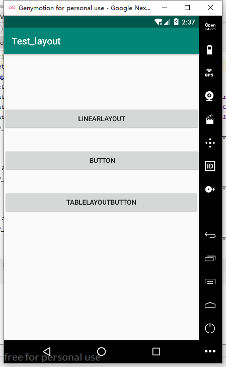
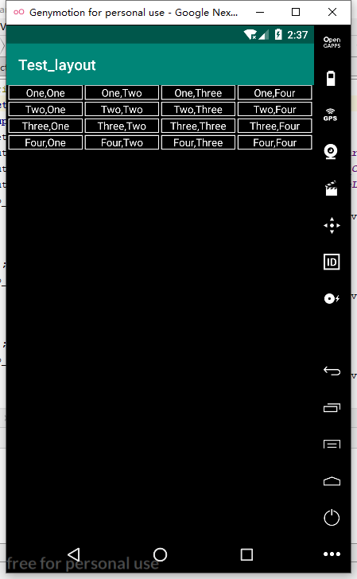

# Read Me
## 程序：Test_layout
### 一、程序功能
实现线性布局、相对布局和表格布局
### 二、相关代码实现及结果
##### MainActivity:  
&emsp;&emsp;设置了三个按钮，分别对应三个布局，即线性布局、相对布局和表格布局，并且实现了跳转功能，可以跳转到相关界面。    


  MainActivity.java：
  ```
public class MainActivity extends AppCompatActivity {

    @Override
    protected void onCreate(Bundle savedInstanceState) {
        super.onCreate(savedInstanceState);
        setContentView(R.layout.activity_main);

        Button to_LinearLaout_button = findViewById(R.id.To_LinearLayout);  //跳转到线性布局的按钮
        Button to_ConstraintLayout_button = findViewById(R.id.To_ConstraintLayout);     //跳转到相对布局的按钮
        Button to_TableLayout_button = findViewById(R.id.To_TableLayout);       //跳转到表格布局的按钮

        to_LinearLaout_button.setOnClickListener(new View.OnClickListener() {
            @Override
            public void onClick(View v) {       //实现跳转功能
                Intent intent = new Intent(MainActivity.this,
                        Show_LinearLayout_Activity.class);
                startActivity(intent);
            }
        });
        to_ConstraintLayout_button.setOnClickListener(new View.OnClickListener() {
            @Override
            public void onClick(View v) {       //实现跳转功能
                Intent intent = new Intent(MainActivity.this,
                        Shouw_ConstraintLayout_Activity.class);
                startActivity(intent);
            }
        });
        to_TableLayout_button.setOnClickListener(new View.OnClickListener() {
            @Override
            public void onClick(View v) {       //实现跳转功能
                Intent intent = new Intent(MainActivity.this,
                        Show_TableLayout_Activity.class);
                startActivity(intent);
            }
        });
    }
}
  ```
activity_main.xml:
```
<?xml version="1.0" encoding="utf-8"?>
<android.support.constraint.ConstraintLayout xmlns:android="http://schemas.android.com/apk/res/android"
    xmlns:app="http://schemas.android.com/apk/res-auto"
    xmlns:tools="http://schemas.android.com/tools"
    android:layout_width="match_parent"
    android:layout_height="match_parent"
    tools:context=".MainActivity">

    <Button
        android:id="@+id/To_LinearLayout"
        android:layout_width="416dp"
        android:layout_height="wrap_content"
        android:layout_marginTop="112dp"
        android:text="@string/linearLayout"
        app:layout_constraintEnd_toEndOf="parent"
        app:layout_constraintHorizontal_bias="0.571"
        app:layout_constraintStart_toStartOf="parent"
        app:layout_constraintTop_toTopOf="parent" />

    <Button
        android:id="@+id/To_TableLayout"
        android:layout_width="411dp"
        android:layout_height="wrap_content"
        android:layout_marginTop="40dp"
        android:layout_marginEnd="8dp"
        android:text="TableLayoutButton"
        app:layout_constraintEnd_toEndOf="parent"
        app:layout_constraintHorizontal_bias="0.0"
        app:layout_constraintStart_toStartOf="parent"
        app:layout_constraintTop_toBottomOf="@+id/To_ConstraintLayout" />

    <Button
        android:id="@+id/To_ConstraintLayout"
        android:layout_width="416dp"
        android:layout_height="wrap_content"
        android:layout_marginTop="40dp"
        android:text="Button"
        app:layout_constraintEnd_toEndOf="parent"
        app:layout_constraintHorizontal_bias="0.219"
        app:layout_constraintStart_toStartOf="parent"
        app:layout_constraintTop_toBottomOf="@+id/To_LinearLayout" />

</android.support.constraint.ConstraintLayout>
```


##### Show_LinearLayout_Activity:
  &emsp;&emsp;实现线性布局，每行文本框的权重都相同。为了实现文本框边框效果，实现了一个shape文件。  

shape_of_textview:
```
<?xml version="1.0" encoding="utf-8"?>
<shape xmlns:android="http://schemas.android.com/apk/res/android">
    <stroke
        android:width="1dp"
        android:color="@android:color/white"/>
    <solid android:color="@android:color/black"></solid>
</shape>
```

activity_show_linear_layout_.xml:
```
<?xml version="1.0" encoding="utf-8"?>
<LinearLayout xmlns:android="http://schemas.android.com/apk/res/android"
    xmlns:app="http://schemas.android.com/apk/res-auto"
    xmlns:tools="http://schemas.android.com/tools"
    android:layout_width="match_parent"
    android:layout_height="match_parent"
    android:orientation="vertical"
    android:background="@android:color/black"
    tools:context=".Show_LinearLayout_Activity">

    <LinearLayout
        android:layout_width="match_parent"
        android:layout_height="wrap_content"
        android:layout_marginBottom="2.5dp">
        <TextView
            android:layout_width="0dp"
            android:layout_height="match_parent"
            android:layout_weight="1"
            android:background="@drawable/shape_of_textview"
            android:text="One,One"
            android:textColor="@android:color/white"
            android:textAlignment="center"
            android:layout_marginLeft="2.5dp"
            android:layout_marginRight="1.5dp"/>
        <TextView
            android:layout_width="0dp"
            android:layout_height="match_parent"
            android:layout_weight="1"
            android:background="@drawable/shape_of_textview"
            android:text="One,Two"
            android:textColor="@android:color/white"
            android:textAlignment="center"
            android:layout_marginLeft="1dp"
            android:layout_marginRight="1.5dp"/>
        <TextView
            android:layout_width="0dp"
            android:layout_height="match_parent"
            android:layout_weight="1"
            android:background="@drawable/shape_of_textview"
            android:text="One,Three"
            android:textColor="@android:color/white"
            android:textAlignment="center"
            android:layout_marginLeft="1dp"
            android:layout_marginRight="1.5dp"/>
        <TextView
            android:layout_width="0dp"
            android:layout_height="match_parent"
            android:layout_weight="1"
            android:background="@drawable/shape_of_textview"
            android:text="One,Four"
            android:textColor="@android:color/white"
            android:textAlignment="center"
            android:layout_marginLeft="1dp"
            android:layout_marginRight="2.5dp"/>
    </LinearLayout>

    <LinearLayout
        android:layout_width="match_parent"
        android:layout_height="wrap_content"
        android:layout_marginBottom="2.5dp">
        <TextView
            android:layout_width="0dp"
            android:layout_height="match_parent"
            android:layout_weight="1"
            android:background="@drawable/shape_of_textview"
            android:text="Two,One"
            android:textColor="@android:color/white"
            android:textAlignment="center"
            android:layout_marginLeft="2.5dp"
            android:layout_marginRight="1.5dp"/>
        <TextView
            android:layout_width="0dp"
            android:layout_height="match_parent"
            android:layout_weight="1"
            android:background="@drawable/shape_of_textview"
            android:text="Two,Two"
            android:textColor="@android:color/white"
            android:textAlignment="center"
            android:layout_marginLeft="1dp"
            android:layout_marginRight="1.5dp"/>
        <TextView
            android:layout_width="0dp"
            android:layout_height="match_parent"
            android:layout_weight="1"
            android:background="@drawable/shape_of_textview"
            android:text="Two,Three"
            android:textColor="@android:color/white"
            android:textAlignment="center"
            android:layout_marginLeft="1dp"
            android:layout_marginRight="1.5dp"/>
        <TextView
            android:layout_width="0dp"
            android:layout_height="match_parent"
            android:layout_weight="1"
            android:background="@drawable/shape_of_textview"
            android:text="Two,Four"
            android:textColor="@android:color/white"
            android:textAlignment="center"
            android:layout_marginLeft="1dp"
            android:layout_marginRight="2.5dp"/>
    </LinearLayout>

    <LinearLayout
        android:layout_width="match_parent"
        android:layout_height="wrap_content"
        android:layout_marginBottom="2.5dp">
        <TextView
            android:layout_width="0dp"
            android:layout_height="match_parent"
            android:layout_weight="1"
            android:background="@drawable/shape_of_textview"
            android:text="Three,One"
            android:textColor="@android:color/white"
            android:textAlignment="center"
            android:layout_marginLeft="2.5dp"
            android:layout_marginRight="1.5dp"/>
        <TextView
            android:layout_width="0dp"
            android:layout_height="match_parent"
            android:layout_weight="1"
            android:background="@drawable/shape_of_textview"
            android:text="Three,Two"
            android:textColor="@android:color/white"
            android:textAlignment="center"
            android:layout_marginLeft="1dp"
            android:layout_marginRight="1.5dp"/>
        <TextView
            android:layout_width="0dp"
            android:layout_height="match_parent"
            android:layout_weight="1"
            android:background="@drawable/shape_of_textview"
            android:text="Three,Three"
            android:textColor="@android:color/white"
            android:textAlignment="center"
            android:layout_marginLeft="1dp"
            android:layout_marginRight="1.5dp"/>
        <TextView
            android:layout_width="0dp"
            android:layout_height="match_parent"
            android:layout_weight="1"
            android:background="@drawable/shape_of_textview"
            android:text="Three,Four"
            android:textColor="@android:color/white"
            android:textAlignment="center"
            android:layout_marginLeft="1dp"
            android:layout_marginRight="2.5dp"/>
    </LinearLayout>

    <LinearLayout
        android:layout_width="match_parent"
        android:layout_height="wrap_content"
        android:layout_marginBottom="2.5dp">
        <TextView
            android:layout_width="0dp"
            android:layout_height="match_parent"
            android:layout_weight="1"
            android:background="@drawable/shape_of_textview"
            android:text="Four,One"
            android:textColor="@android:color/white"
            android:textAlignment="center"
            android:layout_marginLeft="2.5dp"
            android:layout_marginRight="1.5dp"/>
        <TextView
            android:layout_width="0dp"
            android:layout_height="match_parent"
            android:layout_weight="1"
            android:background="@drawable/shape_of_textview"
            android:text="Four,Two"
            android:textColor="@android:color/white"
            android:textAlignment="center"
            android:layout_marginLeft="1dp"
            android:layout_marginRight="1.5dp"/>
        <TextView
            android:layout_width="0dp"
            android:layout_height="match_parent"
            android:layout_weight="1"
            android:background="@drawable/shape_of_textview"
            android:text="Four,Three"
            android:textColor="@android:color/white"
            android:textAlignment="center"
            android:layout_marginLeft="1dp"
            android:layout_marginRight="1.5dp"/>
        <TextView
            android:layout_width="0dp"
            android:layout_height="match_parent"
            android:layout_weight="1"
            android:background="@drawable/shape_of_textview"
            android:text="Four,Four"
            android:textColor="@android:color/white"
            android:textAlignment="center"
            android:layout_marginLeft="1dp"
            android:layout_marginRight="2.5dp"/>
    </LinearLayout>


</LinearLayout>

```

##### Shouw_ConstraintLayout_Activity:
&emsp;&emsp;实现相对布局。  

activity_show_constraint_layout_.xml:
```
<?xml version="1.0" encoding="utf-8"?>
<android.support.constraint.ConstraintLayout xmlns:android="http://schemas.android.com/apk/res/android"
    xmlns:app="http://schemas.android.com/apk/res-auto"
    xmlns:tools="http://schemas.android.com/tools"
    android:layout_width="match_parent"
    android:layout_height="match_parent"
    android:background="@android:color/black"
    tools:context=".Shouw_ConstraintLayout_Activity">

    <TextView
        android:id="@+id/textView8"
        android:layout_width="90dp"
        android:layout_height="70dp"
        android:layout_marginStart="8dp"
        android:layout_marginBottom="390dp"
        android:background="@color/indigo"
        android:gravity="center"
        android:text="INDIGO"
        app:layout_constraintBottom_toBottomOf="parent"
        app:layout_constraintStart_toEndOf="@+id/textView4"
        app:layout_constraintTop_toBottomOf="@+id/textView2" />

    <TextView
        android:id="@+id/textView"
        android:layout_width="70dp"
        android:layout_height="0dp"
        android:layout_marginBottom="71dp"
        android:text="RED"
        android:background="@android:color/holo_red_dark"
        android:gravity="center"
        app:layout_constraintBottom_toTopOf="@+id/textView7"
        app:layout_constraintStart_toStartOf="parent"
        app:layout_constraintTop_toTopOf="parent" />

    <TextView
        android:id="@+id/textView2"
        android:layout_width="100dp"
        android:layout_height="0dp"
        android:layout_marginStart="8dp"
        android:layout_marginEnd="8dp"
        android:layout_marginBottom="71dp"
        android:text="ORANGE"
        android:background="@android:color/holo_orange_dark"
        android:gravity="center"
        app:layout_constraintBottom_toTopOf="@+id/textView8"
        app:layout_constraintEnd_toStartOf="@+id/textView3"
        app:layout_constraintStart_toEndOf="@+id/textView"
        app:layout_constraintTop_toTopOf="parent" />

    <TextView
        android:id="@+id/textView3"
        android:layout_width="70dp"
        android:layout_height="70dp"
        android:background="@color/yellow"
        android:gravity="center"
        android:text="YELLOW"
        app:layout_constraintEnd_toEndOf="parent"
        app:layout_constraintTop_toTopOf="parent" />

    <TextView
        android:id="@+id/textView4"
        android:layout_width="80dp"
        android:layout_height="70dp"
        android:layout_marginTop="68dp"
        android:layout_marginEnd="163dp"
        android:layout_marginBottom="390dp"
        android:background="@color/blue"
        android:gravity="center"
        android:text="BLUE"
        app:layout_constraintBottom_toBottomOf="parent"
        app:layout_constraintEnd_toEndOf="parent"
        app:layout_constraintStart_toEndOf="@+id/textView7"
        app:layout_constraintTop_toBottomOf="@+id/textView2"
        app:layout_constraintVertical_bias="1.0" />

    <TextView
        android:id="@+id/textView7"
        android:layout_width="90dp"
        android:layout_height="70dp"
        android:layout_marginStart="67dp"
        android:layout_marginEnd="8dp"
        android:layout_marginBottom="390dp"
        android:background="@android:color/holo_green_light"
        android:gravity="center"
        android:text="Green"
        app:layout_constraintBottom_toBottomOf="parent"
        app:layout_constraintEnd_toStartOf="@+id/textView4"
        app:layout_constraintStart_toStartOf="parent"
        app:layout_constraintTop_toBottomOf="@+id/textView" />

    <TextView
        android:id="@+id/textView9"
        android:layout_width="0dp"
        android:layout_height="70dp"
        android:layout_marginTop="36dp"
        android:background="@color/violet"
        android:gravity="center"
        android:text="VIOLET"
        app:layout_constraintEnd_toEndOf="parent"
        app:layout_constraintHorizontal_bias="0.0"
        app:layout_constraintStart_toStartOf="parent"
        app:layout_constraintTop_toBottomOf="@+id/textView4" />
</android.support.constraint.ConstraintLayout>
```

##### Show_TableLayout_Activity:
&emsp;&emsp;实现表格布局。  

activity_show_table_layout_.xml:
```
<?xml version="1.0" encoding="utf-8"?>
<TableLayout xmlns:android="http://schemas.android.com/apk/res/android"
    xmlns:app="http://schemas.android.com/apk/res-auto"
    xmlns:tools="http://schemas.android.com/tools"
    android:layout_width="match_parent"
    android:layout_height="match_parent"
    tools:context=".Show_TableLayout_Activity"
    android:stretchColumns="2"
    android:shrinkColumns="0"
    android:background="@android:color/black">
    <TableRow>
        <TextView
            android:layout_width="25dp"
            android:layout_height="match_parent" />
        <TextView
            android:layout_width="100dp"
            android:layout_height="match_parent"
            android:text="Open..."
            android:textColor="@android:color/white"/>
        <TextView
            android:layout_column="2"
            android:text="Ctrl+O"
            android:gravity="right"
            android:textColor="@android:color/white"/>
    </TableRow>
    <TableRow>
        <TextView
            android:layout_width="25dp"
            android:layout_height="match_parent" />
        <TextView
            android:layout_width="100dp"
            android:layout_height="match_parent"
            android:text="Save..."
            android:textColor="@android:color/white"/>
        <TextView
            android:layout_column="2"
            android:text="Ctrl+S"
            android:gravity="right"
            android:textColor="@android:color/white"/>
    </TableRow>
    <TableRow>
        <TextView
            android:layout_width="25dp"
            android:layout_height="match_parent" />
        <TextView
            android:layout_width="100dp"
            android:layout_height="match_parent"
            android:text="Save As..."
            android:textColor="@android:color/white"/>
        <TextView
            android:layout_column="2"
            android:text="Ctrl+shift+s"
            android:gravity="right"
            android:textColor="@android:color/white"/>
    </TableRow>
    <TableRow android:background="@android:color/white">
        <TextView
            android:layout_height="1dp"/>
    </TableRow>
    <TableRow>
        <TextView
            android:text="X"
            android:gravity="center"
            android:textColor="@android:color/white"/>
        <TextView
            android:text="Import..."
            android:textColor="@android:color/white"/>
    </TableRow>
    <TableRow>
        <TextView
            android:text="X"
            android:gravity="center"
            android:textColor="@android:color/white"/>
        <TextView
            android:text="Export..."
            android:textColor="@android:color/white"/>
        <TextView
            android:text="Ctrl+E"
            android:gravity="right"
            android:textColor="@android:color/white"/>
    </TableRow>
    <TableRow android:background="@android:color/white">
        <TextView
            android:layout_height="1dp"/>
    </TableRow>
    <TableRow>
        <TextView
            android:layout_column="1"
            android:text="Quit"
            android:textColor="@android:color/white"/>
    </TableRow>
</TableLayout>
```

